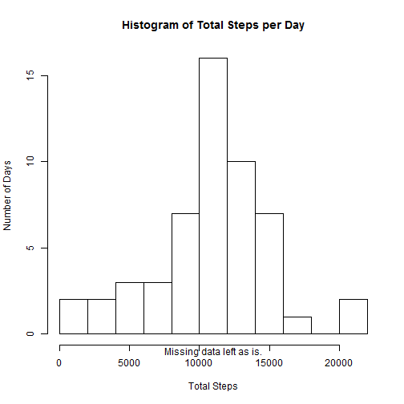
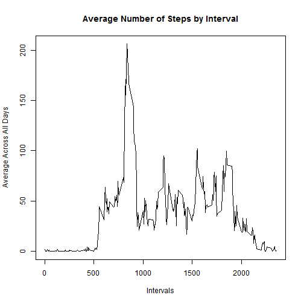
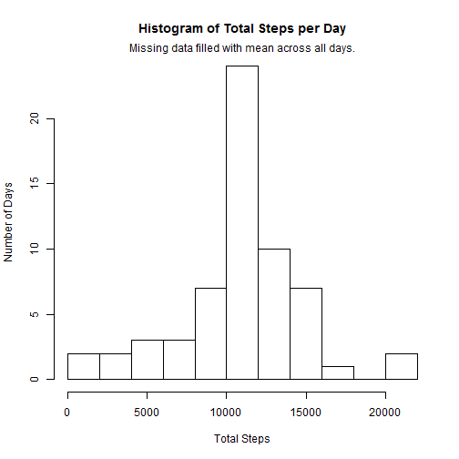

Reproducible Research: Course Project 1
------------------------------------------------
title: "Reproducible Research: Course Project 1"
output:
  html_document:
      keep_md: true
------------------------------------------------


```r
knitr::opts_chunk$set(echo = TRUE, include = TRUE, fig.path='Figs/')
```

# Part 1: Load and Process Data

Read in the course project data. File date stamped 11 February 2014 10:08:00. Process the data for analysis by changing the date to POSXlt format, 


```r
library(lubridate, warn.conflicts = FALSE)
data <- read.csv("activity.csv")
data$date <- ymd(data$date)
```

# Part 2: What is the Mean total number of steps taken per day?

Calculate the total number of steps taken per day. Make a histogram of the total number of steps taken each day. Calculate and repor the mean and median of the total number of steps taken per day. Missing values in the dataset can be ignored.


```r
library(dplyr, warn.conflicts = FALSE)
library(pander, warn.conflicts = FALSE)
data_total <- data %>% group_by(date) %>% 
              summarise(total_steps = sum(steps))
with(data_total, hist(total_steps, breaks = 9, 
                main = "Histogram of Total Steps per Day", 
                ylab = "Number of Days", xlab = "Total Steps"))
      mtext("Missing data left as is.", side = 1)
```



```r
data_mean <- data_total %>% 
                summarise(mean_steps = mean(total_steps, na.rm = TRUE))
data_median <- data_total %>% 
                  summarise(median_steps = median(total_steps, na.rm = TRUE))
data_central <- as.matrix(cbind(data_mean, data_median))
pander(data_central)
```


---------------------------
 mean_steps   median_steps 
------------ --------------
   10766         10765     
---------------------------

# Part 3: What is the average daily activity pattern?

Make a line plot of the 5-minute interval and the average number of steps taken, averaged across all days. Then print the interval with the highest average steps across all days.


```r
data_interval <- data %>% group_by(interval) %>% 
                        summarise(average_steps = mean(steps, na.rm = TRUE))
with(data_interval, plot(average_steps~interval, type= "l", 
                          main = "Average Number of Steps by Interval", 
                          ylab = "Average Across All Days", xlab = "Intervals"))
```



```r
print(data_interval[which.max(data_interval$interval),1])
```

```
## # A tibble: 1 x 1
##   interval
##      <int>
## 1     2355
```

The interval with the highest average steps across all days is 2355.

# Part 4: Imputing missing values

Calculate and report the total number of missing values in the datset. Fill missing data with mean of interval across all days. Calculate the difference between the mean and median with the incomplete and filled data.


```r
print(nrow(data[!complete.cases(data),]))
```

```
## [1] 2304
```

```r
data_fill <- data
for(row in 1:nrow(data)) {
  if((row < nrow(data_interval)) & is.na(data$steps[row])) {
    data_fill$steps[row] <- data_interval$average_steps[row]
  }
  else if(is.na(data$steps[row])) {
    data_fill$steps[row] <- data_interval$average_steps[nrow(data_interval)-row%%nrow(data_interval)]
  }
}
data_fill_total <- data_fill %>% group_by(date) %>% 
                      summarise(total_steps = sum(steps))
with(data_fill_total, hist(total_steps, breaks = 9, 
                      main = "Histogram of Total Steps per Day", 
                      ylab = "Number of Days", xlab = "Total Steps"))
    mtext("Missing data filled with mean across all days.")
```



```r
data_fill_mean <- data_fill_total %>% 
                      summarise(mean_steps = mean(total_steps, na.rm = TRUE))
data_fill_median <- data_fill_total %>% 
                      summarise(median_steps = median(total_steps, na.rm = TRUE))
data_fill_central <- as.matrix(cbind(data_fill_mean, data_fill_median))
pander(data_fill_central)
```


---------------------------
 mean_steps   median_steps 
------------ --------------
   10766         10766     
---------------------------

The total number of missing values in the dataset 2304.

The impact of imputing missing data using the mean value is to increase the number of days where the total number of steps falls around the mean of the sample.

# Part 5: Differences in activity between weekdays and weekends

Create a new factor variable with two levels-"weekend" and "weekday"-indicating whether a given date is a weekday or weekend day. Then make a panel plot containing the average steps taken across all weekday and weekend days over intervals.


```r
library(ggplot2)
data_week <- mutate(data_fill, weekday = weekdays(date))
weekdays <- c("Monday","Tuesday","Wednesday","Thursday","Friday")
data_week$weekday <- factor(c("weekend","weekday")[(data_week$weekday %in% weekdays)+1L])
data_week <- data_week %>% group_by(interval,weekday) %>% 
                        summarise(average_steps = mean(steps, na.rm = TRUE))
ggplot(data = data_week, aes(x = interval, y = average_steps)) + geom_line() + facet_wrap(~weekday)
```


